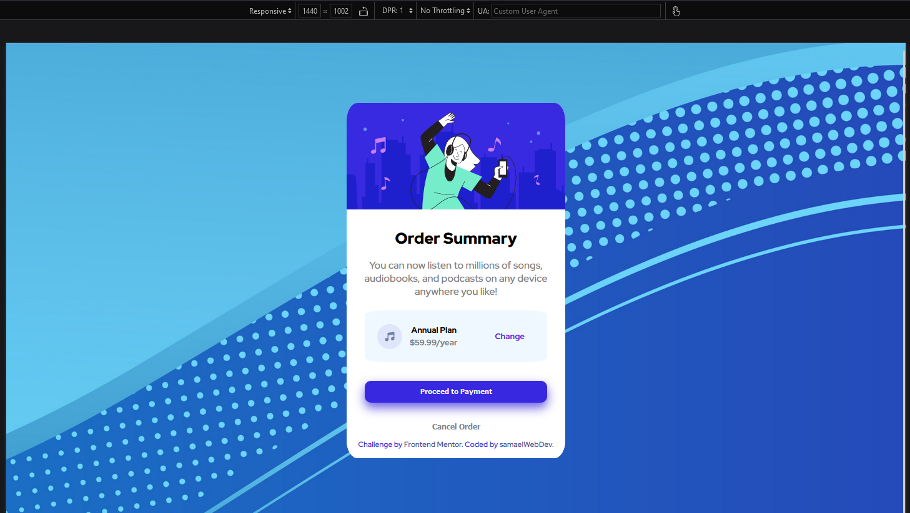
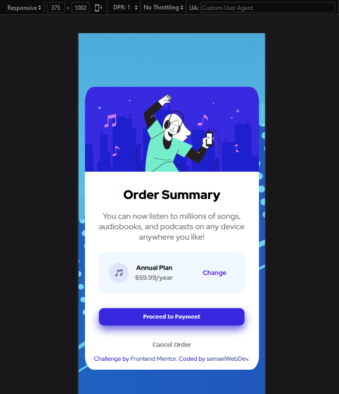

# Frontend Mentor - Order summary card solution

This is a solution to the [Order summary card challenge on Frontend Mentor](https://www.frontendmentor.io/challenges/order-summary-component-QlPmajDUj). Frontend Mentor challenges help you improve your coding skills by building realistic projects.

## Table of contents

- [Overview](#overview)
  - [The challenge](#the-challenge)
  - [Screenshot](#screenshot)
  - [Links](#links)
- [My process](#my-process)
  - [Built with](#built-with)
  - [What I learned](#what-i-learned)
  - [Continued development](#continued-development)
  - [Useful resources](#useful-resources)
- [Author](#author)
- [Acknowledgments](#acknowledgments)

## Overview

HTML and CSS only checkout card made up of 3 sections: header, main and footer.

The header contains the cards image.

The main section of the card is divided into three separate content sections, (card order summary description section, card pricing information section and card check out options section).

The footer contains the challenge creator and the solution creator.

The layout was done using CSS Flexbox and CSS custome properties.

Contains over states for interactive elements.

### The challenge

Users should be able to:

- See hover states for interactive elements

### Screenshot

### Links

- Solution URL: [https://github.com/samaelwebdev/FrontEndMentor-order-summary-component](https://your-solution-url.com)
- Live Site URL: [Add live site URL here](https://your-live-site-url.com)

## My process

1. Define width and height of main container.

2. Define space and appearence taken by the header, main
   section, and footer inside the main container (flexbox container) using CSS (flexbox, positioning, etc).

3. Style the header (add and style image).

4. Style main section content using CSS (flexbox, positioning, etc).

5.Style footer using css (flexbox, positioning, etc).

### Built with

- Semantic HTML5 markup
- CSS custom properties
- Flexbox

### What I learned

I learned about the importance of semantic coding, code writing structure, and thiking about future developers that may edit this project's code.

### Continued development

I plan on completing more projects using complex html css and javascript, my goal is to sharpen my skills in HTML & CSS while learning JavaScript and eventually come back to old projects and add Javascript to them.

### Useful resources

- [Useful resource](https://www.w3schools.com/) - this site has helped me alot while learning website development and I recomend it to everyone.

- [Useful resource](https://css-tricks.com/snippets/css/a-guide-to-flexbox/) - This is an amazing guide on how to use CSS flexbox.

- [Useful resource](https://www.canva.com/) - This is an amazing website to edit/create images.

## Author

- Frontend Mentor - [samaelwebdev](https://www.frontendmentor.io/profile/samaelwebdev)

## Acknowledgments

Thanks to all who take the time to look at this projects and offer their advice in good faith....

HAPPY CODING!!!

